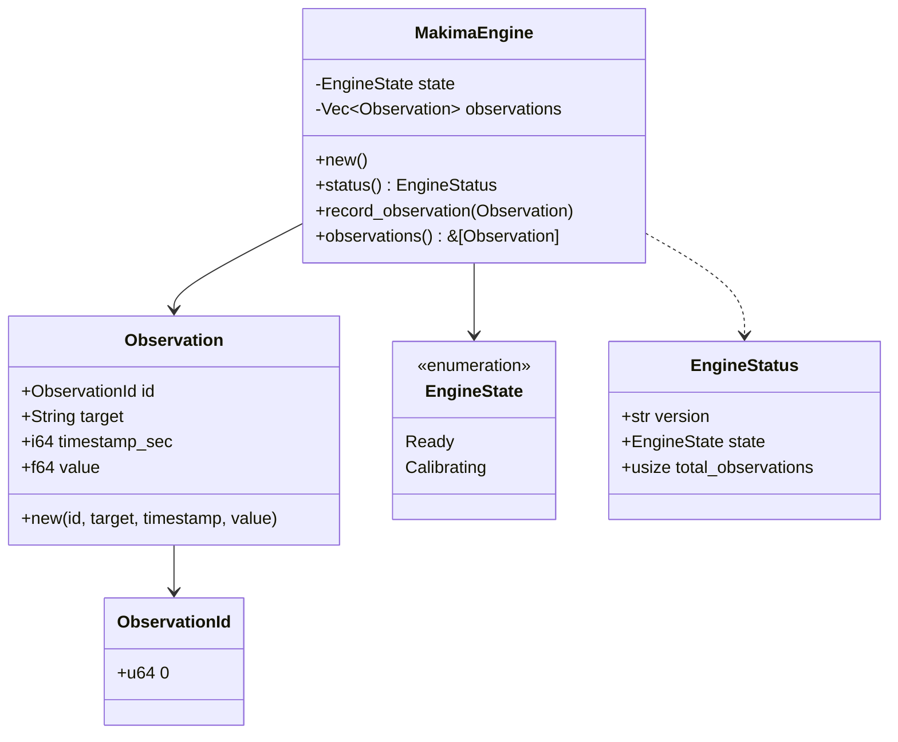

# Makima — Architectural Specification

Questo documento costituisce il contratto architetturale formale di **Makima**. Definisce le invarianti di progettazione, i confini tra i sottosistemi, il ciclo di vita dei dati e dei modelli, i principi di interpretabilità e i non-obiettivi espliciti del sistema.

---

## 1. Vision

Makima è un sistema di previsione probabilistica e quantificazione dell'incertezza, ispirato concettualmente alla *Laplace Mail* di *Shin Megami Tensei: Devil Survivor*.

Il suo scopo è trasformare evidenze empiriche osservabili nel tempo in **distribuzioni di probabilità trasparenti e interpretabili** su eventi futuri. Makima non genera previsioni opache; ogni inferenza prodotta è accompagnata da:
- Le evidenze storiche esatte che l'hanno determinata.
- La quantificazione rigorosa dell'incertezza epistemica e aleatoria.
- La spiegazione della catena di calcolo probabilistico adottata.
- La tracciabilità per la calibrazione a posteriori (*Proper Scoring Rules*).

---

## 2. Architectural Principles

1. **Interpretabilità come Invariante di Primo Ordine**: nessun algoritmo entra nel motore se opera come una black box non ispezionabile o se le sue decisioni non possono essere mappate a precise evidenze e parametri formali.
2. **Separazione Rigorosa tra Ricerca e Runtime**:
   - **Rust (`makima-core`)**: nucleo deterministico, ad alte prestazioni, tipizzato a livello di dominio, privo di dipendenze pesanti inutili, runtime di produzione.
   - **Python (`makima_lab`)**: laboratorio agile per esplorazione euristica, validazione matematica, benchmarking e prototipazione NLP prima dell'ingegnerizzazione.
3. **Nessun Framework Frankenstein**: rifiuto categorico dell'introduzione acritica di dipendenze monolitiche (niente wrapper di neural network generiche, web server o database non motivati dal dominio).
4. **Tracciabilità e Riproducibilità**: ogni simulazione Monte Carlo, stima bayesiana o calcolo entropico deve essere deterministicamente riproducibile a parità di seme (*seed*) e set di osservazioni.
5. **Calibrazione Continua**: Makima misura costantemente la bontà probabilistica dei propri output nel momento in cui l'esito reale dell'evento si manifesta nel tempo (Brier score, Logarithmic score, reliability curves).

---

## 3. Workspace Structure

Il repository è strutturato come un sistema ibrido multi-crate e multi-language:

```text
makima/
├── Cargo.toml                  # Configurazione Cargo workspace root
├── rust-toolchain.toml         # Puntamento a toolchain Rust stabile + linters
├── pyproject.toml              # Packaging e dipendenze del laboratorio scientifico Python
├── avvio.bat                   # Launcher rapido Windows a latenza zero (<300ms, senza test)
├── start.bat                   # Launcher Windows con suite di verifica completa
├── gui.bat                     # Launcher Desktop GUI Tauri v2 (Chat, Grafici, SQLite)
│
├── crates/
│   ├── makima-core/            # Dominio fondazionale, inferenza bayesiana, Poisson, SQLite WAL
│   │   ├── Cargo.toml
│   │   └── src/                # lib.rs, eval.rs, forecast.rs, storage.rs, laplace.rs, prob/
│   ├── makima-cli/             # Interfaccia CLI ad alte prestazioni (main.rs, eyes.rs)
│   │   ├── Cargo.toml
│   │   └── src/
│   └── makima-gui/             # Interfaccia Grafica Desktop nativa Tauri v2 & Frontend Vite
│       ├── package.json
│       ├── index.html
│       ├── src/                # main.js, style.css (Dashboard, Canvas Beta curve, Chat)
│       └── src-tauri/          # Backend Rust IPC (lib.rs, main.rs, tauri.conf.json)
│
├── python/
│   └── makima_lab/             # Laboratorio scientifico e ricerca NLP
│       ├── nlp/                # SemanticQueryParser, ForecastQuery, Intent, TemporalWindow
│       ├── neural/             # MakimaMindNet (PyTorch Self-Attention & Latent Memory)
│       ├── llm/                # QwenCognitiveEngine (SLM locale 0.5B per explain e chat)
│       ├── embeddings.py       # SemanticEmbedder (SentenceTransformers & Cosine Matching)
│       ├── git_observer.py     # Telemetria Git reale e monitoraggio daemon
│       ├── distributions.py    # Distribuzioni probabilistiche in Python
│       ├── evaluation.py       # Valutatore Brier Score ed ECE
│       └── storage.py          # Adapter SQLite WAL e JSON per Python
│
├── experiments/                # Benchmark scientifici, studi di ablazione e calibrazione
│   ├── 01_probabilistic_calibration_benchmark.py
│   └── forecasting/            # Datasets sintetici, baselines, ablation runner, evaluate.py
│
├── docs/                       # Documentazione tecnica, architetturale e matematica
│   ├── architecture.md         # Specifica architetturale e principi di dominio
│   ├── mathematics.md          # Fondamenti matematici, formule e scoring rules
│   └── pipeline_and_dataflow.md # Flusso dati end-to-end, moduli e protocollo Rust-Python
│
├── scripts/                    # Script di automazione e verifica qualità (check.ps1, check.sh)
└── tests/                      # Suite di unit test e integrazione Rust & Python
```

> Per una descrizione dettagliata del flusso dei dati attraverso tutti i componenti e del protocollo di comunicazione tra Rust e Python, consultare [docs/pipeline_and_dataflow.md](file:///c:/Users/biagio.scaglia/Desktop/makima/docs/pipeline_and_dataflow.md).

---

## 4. Domain Model

Il modello di dominio è ospitato in `crates/makima-core` ed è progettato per preservare la coerenza tipologica e l'immutabilità dei dati storici.



- **`ObservationId`**: Newtype pattern che garantisce identificativi univoci, non falsificabili e indicizzabili per ogni singola evidenza.
- **`Observation`**: Rappresentazione immutabile di un dato empirico osservato nel tempo (target, timestamp Unix, grandezza o flag scalare).
- **`EngineState`**: Macchina a stati esplicita che traccia le condizioni operative del motore (`Ready`, `Calibrating`).
- **`MakimaEngine`**: Radice di aggregazione (*Aggregate Root*) che governa il registro delle evidenze e orchestra le future pipeline di previsione.

---

## 5. Data Flow

Il flusso dei dati dall'acquisizione dell'evidenza alla restituzione della previsione strutturata:

```text
[ Sorgente Esterna / User Input ]
                │
                ▼
      ( Ingestion Layer ) ──► Validazione Temporale & Semantica
                │
                ▼
       [ Observation Log ] ──► Immutabile & Tipizzato in Rust Core
                │
                ▼
    ┌───────────────────────┐
    │  Forecasting Pipeline │
    │  - Selezione Evidenze │
    │  - Modello Statistico │
    │  - Simulazione Scenari│
    └───────────────────────┘
                │
                ▼
     [ Forecast Distribution ] ──► P(E), Intervalli di Confidenza, Entropia
                │
                ▼
 [ Output Interpretabile & Tracciabile ] (CLI / API / Evaluation)
```

---

## 6. Rust / Python Boundary

Il confine tra Rust e Python rispetta una gerarchia di dipendenza unidirezionale:

```text
               ┌───────────────────────────────┐
               │    Python Research Lab        │
               │  - Prototipazione modelli     │
               │  - Validazione matematica     │
               │  - Esperimenti NLP / Intent   │
               └───────────────┬───────────────┘
                               │
                      ipotesi confermata?
                               │
                               ▼
               ┌───────────────────────────────┐
               │      Rust Core Engine         │
               │  - Dominio & Invarianti       │
               │  - Calcolo probabilistico     │
               │  - Simulazioni Monte Carlo    │
               │  - Runtime di produzione      │
               └───────────────┬───────────────┘
                               │
                               ▼
               ┌───────────────────────────────┐
               │     Export Bridge (PyO3)      │
               │  (Futura esposizione verso    │
               │   Python per benchmark/lab)   │
               └───────────────────────────────┘
```

1. **Nessun Codice Core in Python**: la logica operativa finale di Makima risiede al 100% in Rust.
2. **Nessun Crate Wrapper Vuoto**: Rust non fa da semplice bind verso script Python.
3. **Bridge Futuro (PyO3/maturin)**: quando un algoritmo in Rust sarà maturo, potrà essere esposto verso Python per analisi retrospettive o visualizzazioni nel lab, mai il contrario per il runtime critico.

---

## 7. Observation Lifecycle

Ogni osservazione attraversa le seguenti fasi:

1. **Cattura**: generazione dell'evidenza con target semantico, valore scalare e timestamp cronologico.
2. **Assegnazione ID**: attribuzione di un `ObservationId` deterministico/monotonico.
3. **Persistenza in Memoria/Stoccaggio**: inserimento nello storico immutabile del motore (`record_observation`).
4. **Indicizzazione**: catalogazione per target e finestra temporale di pertinenza.
5. **Consumo nei Modelli**: utilizzo come dato empirico per l'aggiornamento dei prior o delle frequenze storiche.

---

## 8. Forecasting Lifecycle

Quando Makima riceve una richiesta di previsione:

1. **Strutturazione del Target**: definizione dell'evento $E$ e dell'orizzonte temporale $T$.
2. **Recupero Evidenze**: estrazione del sottoinsieme di osservazioni rilevanti per il target.
3. **Esecuzione Modello**: applicazione della distribuzione statistica selezionata (es. modelli di conteggio Poisson, catene di Markov, inferenza bayesiana).
4. **Quantificazione dell'Incertezza**: calcolo di varianza, entropia di Shannon della distribuzione ed estremi dell'intervallo di credibilità al 95%.
5. **Emissione della Risposta**: restituzione dell'oggetto previsione contenente la distribuzione, il punteggio di confidenza e la lista puntuale degli `ObservationId` utilizzati come prova (*Evidence*).

---

## 9. State Management & Storage Layer

- **Determinismo ed Event Sourcing**: lo stato interno è una funzione esplicita dello storico delle osservazioni accumulate. Il sistema implementa un pattern ad **Event Sourcing** (`event_log`) in cui ogni evidenza o esito registrato è immutabile e tracciato temporalmente.
- **Transizioni di Stato**: le transizioni dell'istanza (es. da `Ready` a `Calibrating`) avvengono solo tramite metodi controllati di `MakimaEngine`.
- **Storage SQLite WAL Integrato**: la persistenza locale ad alte prestazioni avviene mediante SQLite incorporato con modalità **WAL (Write-Ahead Logging)** in [`.makima/makima.db`](.makima/makima.db), con sincronizzazione automatica bidirezionale verso file JSON leggibili [`.makima/store.json`](.makima/store.json).
- **Concorrenza Rust & Python**: la modalità WAL garantisce letture concorrenti non bloccanti tra il runtime compilato `makima-cli` e il laboratorio di ricerca `makima_lab`.

---

## 10. Interpretability Model

Makima non produce mai un singolo valore numerico privo di contesto. L'interpretabilità si articola su tre livelli:

1. **Tracciabilità delle Evidenze**: ogni stima dichiara esattamente quali osservazioni storiche hanno contribuito al calcolo.
2. **Trasparenza dei Parametri**: i parametri dei modelli (es. prior $\alpha, \beta$, tassi $\lambda$, matrici di transizione) sono sempre leggibili e documentabili.
3. **Scomposizione dell'Incertezza**: distinzione esplicita tra incertezza dovuta alla variabilità intrinseca del fenomeno (aleatoria) e incertezza dovuta alla scarsità di dati storici (epistemica).

---

## 10. Cognitive Neural Mind & Continuous Learning (`MakimaMindNet`)

Il modulo `makima_lab.neural` introduce una rete neurale profonda in PyTorch concepita per estrarre semantica densa, intenti e tracciare la memoria dell'utente nel continuo:

```text
       [ Testo Naturale / Riflessioni Utente ]
                          │
                          ▼
            [ Tokenizer & Embedding Layer ]
                          │
                          ▼
       [ Bidirectional GRU + Self-Attention ]
                          │
                          ▼
        [ User Latent Memory Cell (GRU Cell) ] ◄── (Stato continuo persistente)
        /                 │                \
       ▼                  ▼                 ▼
[ Intent Classifier ]  [ Target Embedding ]  [ Bayesian Calibration Bridge ]
  (Query/Journal/...)   (Cosine Similarity)   (Prior α, β, λ & Polarity)
```

1. **Memoria Latente Recorrente**: Un vettore di stato continuo $\mathbf{h}_{user} \in \mathbb{R}^{64}$ evolve ad ogni interazione (`makima tell`), memorizzando abitudini e contesto dell'utente.
2. **Online Gradient Backpropagation**: La rete neurale esegue aggiornamenti di gradiente in tempo reale (AdamW) con salvataggio dei pesi in `.makima/makima_brain.pt`.
3. **Ponte Bayesiano Trasparente**: I layer di calibrazione proiettano la rappresentazione neurale nei parametri analitici della distribuzione a priori $\text{Beta}(\alpha_0, \beta_0)$ e $\text{Poisson}(\lambda)$, garantendo calibrazione probabilistica senza allucinazioni.

---

## 11. Real Git Telemetry & Background Daemon Mode

Il modulo `makima_lab.git_observer` collega Makima direttamente all'attività reale di sviluppo dell'utente:

```text
  [ Git Repository Activity ] ──► [ GitObserver ]
                                         │
                 ┌───────────────────────┴───────────────────────┐
                 ▼                                               ▼
     [ Target Categorization ]                       [ Real-Time Neural Learning ]
  - git:feature_ratio (Beta prior)                 - MakimaMindNet online learn
  - git:test_discipline (Beta prior)               - User Latent State Update
  - git:commit_frequency (Poisson λ)               - SQLite WAL Event Sourcing
```

1. **Estrazione di Frequenze Reali**: Calcola empiricamente l'intervallo temporale medio e il tasso $\lambda$ per processi di conteggio Poisson.
2. **Modalità Daemon**: Il watcher in background intercetta i commit non appena vengono creati, aggiornando la memoria dell'assistente e le distribuzioni a priori senza richiedere inserimenti manuali.

---

## 12. Semantic Vector Embeddings & Target Resolution (`SemanticEmbedder`)

Il modulo `makima_lab.embeddings` fornisce rappresentazioni vettoriali dense a 384 dimensioni basate su Sentence-Transformers (`all-MiniLM-L6-v2`) con fallback deterministico su proiezioni hash subword:

```text
  [ Query NL Utente ] ──► [ SemanticEmbedder ] ──► Vettore u ∈ ℝ³⁸⁴
                                                         │
                                               Similarità Coseno
                                            cos(u, v) = (u · v) / (||u|| ||v||)
                                                         │
  [ Target Registrati SQLite / Git ] ──────────► Vettori {v_t} ∈ ℝ³⁸⁴
                                                         │
                                                         ▼
                                             Target Ottimale Selezionato
                                            (es: "nuova feature" ➔ git:feature_ratio)
```

1. **Risoluzione Semantica Dinamica**: Invece di vincoli lessicali rigidi, il parser interroga l'elenco dei target realmente monitorati nel database SQLite ed effettua il matching basandosi sulla massima similarità coseno dello spazio semantico.
2. **Affidabilità Offline**: In assenza di connessione o librerie esterne, l'embedder commuta trasparentemente su proiezioni hash ad alta dimensionalità senza interrompere il flusso previsionale.

---

## 13. Testing Strategy

La validità del sistema è garantita da più livelli di test:
- **Rust Unit Tests**: correttezza dei singoli tipi, invarianti di dominio e funzioni matematiche elementari.
- **Rust Integration Tests**: pipeline end-to-end all'interno dei crate.
- **Neural Tests**: verifica della convergenza dell'encoder `MakimaMindNet`, propagazione della memoria e online learning.
- **Git Telemetry Tests**: verifica dell'osservatore e categorizzazione automatica dei commit.
- **Embedding & NLP Tests**: verifica della similarità semantica, estrazione dei target reali e parsing temporale.
- **Mathematical Property-Based Tests**: verifica di proprietà assiomatiche (es. $\sum P(X) = 1$, divergenza KL $\ge 0$, simmetria dove prevista).
- **Python Lab Tests**: verifica della riproducibilità numerica degli esperimenti statistici e coerenza del setup.

---

## 14. Reproducibility

- **Controllo dei Semi (*Seed*)**: qualsiasi componente stocastico (es. Monte Carlo) deve accettare un generatore di numeri pseudo-casuali inizializzato con seed esplicito.
- **Versionamento degli Algoritmi**: qualsiasi evoluzione di un modello previsionale viene tracciata semanticamente per consentire il confronto retrospettivo.

---

## 15. Error Handling

- **Rifiuto di `unwrap()` e `expect()` non motivati**: nel codice di produzione `makima-core` gli errori devono essere modellati con `Result<T, E>` e tipi di errore espliciti.
- **Fallimenti Trasparenti**: se le evidenze per un target sono insufficienti per formulare una distribuzione valida, il motore restituisce uno stato di incertezza massima anziché una stima fuorviante.

---

## 16. Future Extension Points

- **`makima-math`**: modulo specializzato per distribuzioni probabilistiche, entropia, divergenza KL e matrici di transizione markoviane.
- **`makima-nlp`**: modulo di parsing semantico per trasformare frasi in linguaggio naturale in query strutturate.
- **`makima-storage`**: layer di persistenza compatto e tracciabile per le serie storiche di osservazioni.
- **`makima-wasm`**: compilazione del core in WebAssembly per esecuzione locale e edge priva di dipendenze server.

---

## 17. Explicit Non-Goals (Cosa Makima NON è)

Per preservare l'integrità concettuale e tecnica del progetto, Makima **NON** è e non diventerà:

1. ❌ **Un Chatbot o un wrapper LLM**: Makima non si basa su modelli linguistici black-box per generare stime probabilistiche.
2. ❌ **Un Framework di Machine Learning generico**: non implementa reti neurali arbitrarie o astrazioni superflue per rimpiazzare librerie esistenti.
3. ❌ **Un Oracolo Opaco (*Black Box*)**: non produce mai previsioni oracolari prive di catena di inferenza verificabile.
4. ❌ **Un Decision Maker Autonomo**: Makima quantifica probabilità e incertezza su dati empirici; non prende decisioni d'azione al posto dell'utente.
5. ❌ **Un'interfaccia cosmetica senza fondamento formale**: nessuna formula, grafico o metrica statistica viene introdotta senza un'implementazione matematica rigorosa, testata e validata.
