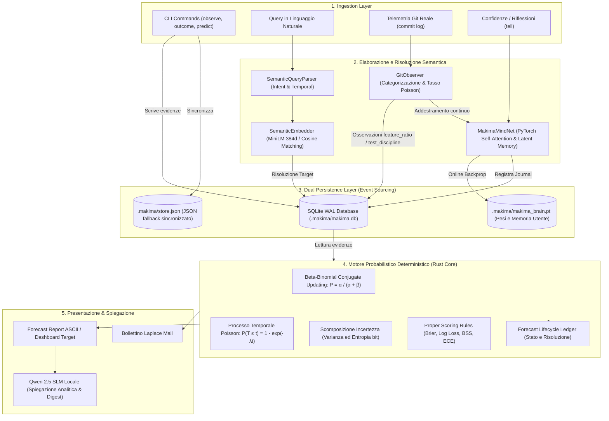

# Makima — Pipeline, Data Flow & Module Architecture

Questo documento descrive in dettaglio il funzionamento interno di **Makima**: il ciclo di vita dei dati, la responsabilità di ciascun modulo, il meccanismo di cooperazione tra Rust e Python, e l'architettura della pipeline di elaborazione semantica e probabilistica.

---

## 1. Visione d'Insieme del Flusso dei Dati

Makima è progettato attorno al paradigma della **trasparenza probabilistica** ed **Event Sourcing**: qualsiasi stima numerica deve essere riconducibile a evidenze storiche esatte e a distribuzioni coniugate analitiche.



---

## 2. Responsabilità dei Moduli

Il repository è ripartito rigorosamente tra runtime compilato di produzione (`crates/`) e laboratorio scientifico/NLP (`python/` ed `experiments/`):

### 2.1 Crate Rust (`crates/`)

| Modulo / Crate | Percorso | Responsabilità Primaria |
| :--- | :--- | :--- |
| **`makima-core`** | `crates/makima-core/` | **Nucleo di dominio e calcolo probabilistico**: definisce entità immutabili (`Observation`, `ObservationId`), distribuzioni analitiche (`Bernoulli`, `BetaDistribution`, `PoissonDistribution`), motore centrale (`MakimaEngine`), valutatore statistico (`Evaluator`, `Scoring`), ledger delle previsioni (`ForecastLedger`) e layer di persistenza nativo (`MakimaStore`, `MakimaDb`). |
| **`makima-cli`** | `crates/makima-cli/` | **Interfaccia da riga di comando ad alte prestazioni**: parsing dei comandi del terminale, visualizzazione diagnostica, rendering del ritratto ASCII di Makima, dispatch dei comandi previdenziali e ponte di esecuzione verso i sottoprocessi Python del laboratorio. |

### 2.2 Moduli Python (`python/makima_lab/`)

| Sottosistema | Percorso | Responsabilità Primaria |
| :--- | :--- | :--- |
| **`makima_lab.nlp`** | `python/makima_lab/nlp/` | **Analisi del linguaggio naturale**: normalizzazione semantica del testo, classificazione degli intenti (`Intent`), estrazione di orizzonti temporali (`TemporalWindow`), risoluzione automatica del target tramite embedding vettoriali e orchestrazione della pipeline previsionale (`SemanticForecastPipeline`). |
| **`makima_lab.embeddings`** | `python/makima_lab/embeddings.py` | **Vettorizzazione semantica densa**: genera embedding a 384 dimensioni mediante Sentence-Transformers (`all-MiniLM-L6-v2`) con fallback deterministico su proiezioni hash subword; calcola la similarità coseno per associare query utente a target reali del database. |
| **`makima_lab.neural`** | `python/makima_lab/neural/` | **Rete Neurale Cognitiva (`MakimaMindNet`)**: architettura PyTorch con BiGRU, Multi-Head Self-Attention, cella di memoria latente ricorrente dell'utente ($\mathbf{h}_{user} \in \mathbb{R}^{64}$), classificazione multi-task e apprendimento online continuo (AdamW). |
| **`makima_lab.git_observer`** | `python/makima_lab/git_observer.py` | **Telemetria Git reale & Daemon**: estrazione dello storico dei commit dal repository, categorizzazione semantica (italiano/inglese), stima empirica della frequenza Poisson ($\lambda$) e monitoraggio in background per nuovi commit. |
| **`makima_lab.llm`** | `python/makima_lab/llm/` | **Ragionamento e spiegazione con Small Language Model (SLM)**: inferenza locale su `Qwen/Qwen2.5-0.5B-Instruct` con caricamento offline prioritario da cache, generazione di spiegazioni trasparenti delle formule (`explain`), sintesi esecutive (`digest`) e sessione chat interattiva continua (`chat`). |
| **`makima_lab.storage`** | `python/makima_lab/storage.py` | **Astrazione storage lato Python**: interfacciamento con `.makima/makima.db` (SQLite WAL) e `.makima/store.json`, calcolo della Knowledge Base e registrazione di voci di diario. |

### 2.3 Modulo di Validazione Sperimentale (`experiments/`)

| Directory | Percorso | Responsabilità Primaria |
| :--- | :--- | :--- |
| **`experiments.forecasting`** | `experiments/forecasting/` | **Suite scientifica comparativa**: generatori di dataset sintetici con Ground Truth nota (`stationary_stream`, `regime_shifts`, `poisson_arrivals`), implementazione di 7 modelli baseline comparativi, motore di calcolo Proper Scoring Rules (Brier, LogLoss, BSS, ECE) e runner di Ablation Study. |

---

## 3. Comunicazione e Sincronizzazione tra Rust e Python

Makima adotta un'architettura **ibrida asincrona/disaccoppiata**:

```text
  ┌─────────────────────────────────────────────────────────────┐
  │                    Spazio Applicativo                       │
  ├──────────────────────────────┬──────────────────────────────┤
  │       Rust Runtime Core      │      Python Research Lab     │
  │      (Prestazioni & ACID)    │    (NLP, PyTorch & SLM)      │
  └──────────────┬───────────────┴──────────────┬───────────────┘
                 │                              │
                 ▼                              ▼
  ┌─────────────────────────────────────────────────────────────┐
  │               SQLite WAL Database (.makima/makima.db)       │
  │   - journal_mode = WAL (Write-Ahead Logging)                │
  │   - Letture concorrenti non bloccanti                       │
  │   - Tabella immutabile: event_log & observations            │
  └──────────────────────────────┬──────────────────────────────┘
                                 │
                                 ▼
  ┌─────────────────────────────────────────────────────────────┐
  │               JSON Snapshot (.makima/store.json)            │
  │   - Formato human-readable per backup e ispezione manuale   │
  └─────────────────────────────────────────────────────────────┘
```

### 3.1 Canali di Cooperazione

1. **Storage Condiviso SQLite WAL (`.makima/makima.db`)**:
   - Sia Rust (`rusqlite`) sia Python (`sqlite3`) aprono il database con `PRAGMA journal_mode = WAL;`.
   - Il WAL (*Write-Ahead Logging*) consente a processi concorrenti di leggere senza bloccare chi scrive, evitando conflitti di lock tra la CLI Rust e i daemon/script Python.
2. **Snapshot JSON di Fallback (`.makima/store.json`)**:
   - Ad ogni mutazione, `MakimaEngine` sincronizza la rappresentazione di stato su JSON, permettendo al laboratorio Python di leggere lo storico completo anche in assenza di driver relazionali.
3. **Dispatch Subprocess da CLI Rust a Python**:
   - Quando l'utente invoca comandi che richiedono modelli linguistici o neurali (`makima query`, `makima tell`, `makima neural`, `makima sync-git`), `makima-cli` richiama l'interprete Python configurando `PYTHONPATH=python` ed eseguendo il modulo `makima_lab`.
   - Se Python o i moduli opzionali non sono disponibili, la CLI Rust degrada elegantemente informando l'utente senza provocare panic.

---

## 4. Pipeline Neurale & NLP Multi-Livello

La comprensione del linguaggio naturale è affidata a [`makima_lab.nlp`](file:///c:/Users/biagio.scaglia/Desktop/makima/python/makima_lab/nlp). A differenza di un approccio monolitico con prompt non vincolati, Makima adotta una pipeline a stadi specializzati che produce un oggetto fortemente tipizzato e validato: [`StructuredIntent`](file:///c:/Users/biagio.scaglia/Desktop/makima/python/makima_lab/nlp/schemas/structured_intent.py).

### 4.1 Ciclo di Elaborazione Semantica a 8 Livelli

```text
Frase Utente: "Quando rilascerò il prossimo framework?"
                             │
                             ▼
 1. Preprocessing            ──► Pulizia Unicode NFKC, normalizzazione apostrofi e spazi
                             │
                             ▼
 2. Tokenizzazione           ──► Suddivisione in parole, stopword filtering, estrazione n-grammi
                             │
                             ▼
 3. Rappresentazione         ──► MiniLM-L6-v2 384-dim (L2 normalizzato) & Cosine Space
                             │
                             ▼
 4. Intent Classification    ──► Intent.TEMPORAL_QUERY (pattern sintattici & indizi lessicali)
                             │
                             ▼
 5. Target Extraction        ──► Descrittori canonici & ranking embeddings: "framework_release"
                             │
                             ▼
 6. Temporal Understanding   ──► TemporalRelation.FUTURE (orizzonte temporale futuro)
                             │
                             ▼
 7. Confidence Estimation    ──► Formula composita trasparente pesata (Score: 0.82)
                             │
                             ▼
 8. Validation & Guardrails  ──► is_valid_for_core = True, notes = ["Struttura conforme"]
                             │
                             ▼
       StructuredIntent DTO  ──► Serializzazione JSON deterministica per Rust Core
                             │
                             ▼
 9. Esecuzione Rust Core     ──► Aggiornamento Beta-Binomiale & Distribuzione Temporale
```

### 4.2 Tassonomia di Dominio NLP & Schemi

#### `Intent`
- **`QUERY`**: Richiesta di stima o probabilità su un target noto.
- **`TEMPORAL_QUERY`**: Domanda legata a una collocazione temporale specifica (*"quando...", "in che data..."*).
- **`COMMAND`**: Istruzione operativa diretta per il motore (es. sincronizzazione Git, ricalibrazione).
- **`INFORMATION`**: Domande esplicative di dominio (es. spiegazione formule, Brier score).
- **`OBSERVATION`**: Registrazione di un'evidenza empirica osservata.
- **`STATUS`**: Ispezione dello stato interno del motore e diagnostica.
- **`UNKNOWN`**: Input ambigui, chitchat o fuori dominio. Vengono esplicitamente respinti senza allucinazioni.

#### `TemporalRelation` & `TemporalWindow`
- **`PAST`**: Evento o serie collocata nel passato.
- **`PRESENT`**: Stato corrente o attività in corso.
- **`FUTURE`**: Prossimo evento futuro o rilascio software.
- **`RELATIVE_INTERVAL`**: Finestra temporale parametrica di $N$ giorni o settimane (es. *"entro 7 giorni"*).
- **`SPECIFIC_DATE`**: Data puntuale di calendario conforme ISO-8601 o mese nominale.
- **`UNKNOWN`**: Orizzonte non specificato esplicitamente.

---

## 5. Ciclo di Vita delle Previsioni (Forecast Lifecycle Ledger)

Ogni previsione formale emessa da Makima attraversa un ciclo di vita controllato e tracciato nel ledger:

1. **Emissione (`Pending`)**:
   - Viene generato un identificativo incrementale (`ForecastId`).
   - Vengono congelati nel ledger: probabilità $E[P]$, finestra temporale, numero di evidenze utilizzate e nome del modello.
2. **Attesa dell'Esito Reale**:
   - La previsione rimane nello stato `PENDING` nel ledger (`makima forecasts`).
3. **Risoluzione con Ground Truth (`Resolved`)**:
   - L'utente registra l'evento effettivo (`makima outcome <target> <1|0>`).
   - Lo stato transita a `RESOLVED` con registrazione dell'esito reale ($1$ o $0$).
4. **Scoring e Calibrazione**:
   - Viene calcolato istantaneamente il Brier Score individuale $(p - y)^2$ e la Logarithmic Loss.
   - La previsione viene assegnata a uno dei bin di calibrazione empirica per il calcolo cumulativo dell'ECE (*Expected Calibration Error*).
