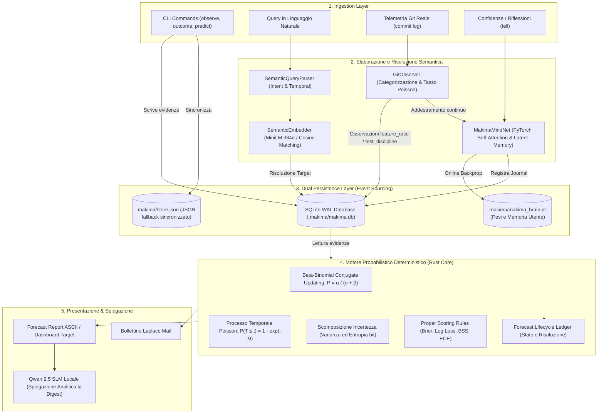

# Makima — Pipeline, Data Flow & Module Architecture

Questo documento descrive in dettaglio il funzionamento interno di **Makima**: il ciclo di vita dei dati, la responsabilità di ciascun modulo, il meccanismo di cooperazione tra Rust e Python, e l'architettura della pipeline di elaborazione semantica e probabilistica.

---

## 1. Visione d'Insieme del Flusso dei Dati

Makima è progettato attorno al paradigma della **trasparenza probabilistica** ed **Event Sourcing**: qualsiasi stima numerica deve essere riconducibile a evidenze storiche esatte e a distribuzioni coniugate analitiche.


```mermaid
flowchart TD
    subgraph Input ["1. Ingestion Layer"]
        CLI["CLI Commands (observe, outcome, predict)"]
        NL["Query in Linguaggio Naturale"]
        GIT["Telemetria Git Reale (commit log)"]
        USER_FACTS["Confidenze / Riflessioni (tell)"]
    end

    subgraph Processing ["2. Elaborazione e Risoluzione Semantica"]
        PARSER["SemanticQueryParser (Intent & Temporal)"]
        EMB["SemanticEmbedder (MiniLM 384d / Cosine Matching)"]
        MIND["MakimaMindNet (PyTorch Self-Attention & Latent Memory)"]
        GIT_OBS["GitObserver (Categorizzazione & Tasso Poisson)"]
    end

    subgraph Persistence ["3. Dual Persistence Layer (Event Sourcing)"]
        SQLITE[("SQLite WAL Database (.makima/makima.db)")]
        JSON[(".makima/store.json (JSON fallback sincronizzato)")]
        BRAIN[(".makima/makima_brain.pt (Pesi e Memoria Utente)")]
    end

    subgraph CoreEngine ["4. Motore Probabilistico Deterministico (Rust Core)"]
        BETA["Beta-Binomial Conjugate Updating: P = α / (α + β)"]
        POISSON["Processo Temporale Poisson: P(T ≤ t) = 1 - exp(-λt)"]
        UNCERT["Scomposizione Incertezza (Varianza ed Entropia bit)"]
        SCORING["Proper Scoring Rules (Brier, Log Loss, BSS, ECE)"]
        LEDGER["Forecast Lifecycle Ledger (Stato e Risoluzione)"]
    end

    subgraph Output ["5. Presentazione & Spiegazione"]
        REPORT["Forecast Report ASCII / Dashboard Target"]
        MAIL["Bollettino Laplace Mail"]
        SLM["Qwen 2.5 SLM Locale (Spiegazione Analitica & Digest)"]
    end

    CLI -->|Scrive evidenze| SQLITE
    CLI -->|Sincronizza| JSON
    NL --> PARSER
    PARSER --> EMB
    EMB -->|Risoluzione Target| SQLITE
    USER_FACTS --> MIND
    MIND -->|Online Backprop| BRAIN
    MIND -->|Registra Journal| SQLITE
    GIT --> GIT_OBS
    GIT_OBS -->|Osservazioni feature_ratio / test_discipline| SQLITE
    GIT_OBS -->|Addestramento continuo| MIND

    SQLITE -->|Lettura evidenze| CoreEngine
    CoreEngine --> REPORT
    CoreEngine --> MAIL
    CoreEngine --> LEDGER
    REPORT --> SLM
```

---

## 2. Responsabilità dei Moduli

Il repository è ripartito rigorosamente tra runtime compilato di produzione (`crates/`) e laboratorio scientifico/NLP (`python/` ed `experiments/`):

### 2.1 Crate Rust (`crates/`)

| Modulo / Crate | Percorso | Responsabilità Primaria |
| :--- | :--- | :--- |
| **`makima-core`** | `crates/makima-core/` | **Nucleo di dominio e calcolo probabilistico**: definisce entità immutabili (`Observation`, `ObservationId`), distribuzioni analitiche (`Bernoulli`, `BetaDistribution`, `PoissonDistribution`), motore centrale (`MakimaEngine`), valutatore statistico (`Evaluator`, `Scoring`), ledger delle previsioni (`ForecastLedger`) e layer di persistenza nativo (`MakimaStore`, `MakimaDb`). |
| **`makima-cli`** | `crates/makima-cli/` | **Interfaccia da riga di comando nativa**: parsing dei comandi del terminale, visualizzazione diagnostica, rendering del ritratto ASCII di Makima, dispatch dei comandi previdenziali e ponte verso il laboratorio Python. |
| **`makima-gui`** | `crates/makima-gui/` | **Interfaccia Desktop Nativa Tauri v2 & Frontend Canvas**: dashboard interattiva delle curve Beta, monitoraggio ledger previsioni, chat con monologo interiore, e **Second Brain Canvas Visualizer** con simulazione fisica force-directed e gestione memorie in tempo reale. |

### 2.2 Moduli Python (`python/makima_lab/`)

| Sottosistema | Percorso | Responsabilità Primaria |
| :--- | :--- | :--- |
| **`makima_lab.mind`** | `python/makima_lab/mind/` | **Mente Cognitiva, Coscienza & Second Brain**: motore di deliberazione a 4 stadi (`MindDeliberationEngine`), memoria autobiografica persistente (`EpisodicMemoryStore`), battito autonomo di pensiero (`AutonomousMindPulse`), e costruttore del grafo di conoscenza sinaptico (`SecondBrainBuilder`). |
| **`makima_lab.nlp`** | `python/makima_lab/nlp/` | **Pipeline NLP euristica multi-stadio**: preprocessing, intent regex, target matching, temporale, confidenza, validazione → `StructuredIntent` JSON. |
| **`makima_lab.embeddings`** | `python/makima_lab/embeddings.py` | **Vettorizzazione semantica densa**: genera embedding a 384 dimensioni mediante Sentence-Transformers (`all-MiniLM-L6-v2`) con caricamento locale prioritario e fallback deterministico su proiezioni hash subword; calcola la similarità coseno per associare query utente a target reali del database. |
| **`makima_lab.neural`** | `python/makima_lab/neural/` | **Rete Neurale Cognitiva (`MakimaMindNet`)**: architettura PyTorch con BiGRU, Multi-Head Self-Attention, cella di memoria latente ricorrente dell'utente ($\mathbf{h}_{user} \in \mathbb{R}^{64}$), classificazione multi-task e apprendimento online continuo (AdamW). |
| **`makima_lab.git_observer`** | `python/makima_lab/git_observer.py` | **Telemetria Git reale & Daemon**: estrazione dello storico dei commit dal repository, categorizzazione semantica (italiano/inglese), stima empirica della frequenza Poisson ($\lambda$) e monitoraggio in background per nuovi commit. |
| **`makima_lab.llm`** | `python/makima_lab/llm/` | **SLM opzionale**: `Qwen/Qwen2.5-0.5B-Instruct` solo per explain/digest (non per probabilità né structured intent). |
| **`makima_lab.storage`** | `python/makima_lab/storage.py` | **Astrazione storage lato Python**: interfacciamento con `.makima/makima.db` (SQLite WAL), `.makima/mind_journal.jsonl` e `.makima/store.json`. |

### 2.3 Modulo di Validazione Sperimentale (`experiments/`)

| Directory | Percorso | Responsabilità Primaria |
| :--- | :--- | :--- |
| **`experiments.forecasting`** | `experiments/forecasting/` | **Suite scientifica comparativa**: generatori di dataset sintetici con Ground Truth nota (`stationary_stream`, `regime_shifts`, `poisson_arrivals`), implementazione di 7 modelli baseline comparativi, motore di calcolo Proper Scoring Rules (Brier, LogLoss, BSS, ECE) e runner di Ablation Study. |

---

## 3. Comunicazione e Sincronizzazione tra Rust e Python

Makima adotta un'architettura **ibrida disaccoppiata** con contratto esplicito:

```text
  Query NL ──► python -m makima_lab parse-intent ──► StructuredIntent JSON
                                                      │
                                                      ▼
                         makima-cli / makima-gui ──► makima-core.predict_target
                                                      │
                                                      ▼
                                              Forecast + Ledger (Rust)
```

Persistenza condivisa: SQLite WAL (`.makima/makima.db`) + snapshot JSON (`.makima/store.json`).

Regole operative:
1. **Python non calcola probabilità sul path CLI/GUI di produzione.** Il parser emette solo `StructuredIntent`.
2. **Rust è l'unico motore numerico di runtime** (Beta, Poisson, scoring, ledger).
3. **Nessuna evidenza sintetica** nello store iniziale: solo `observe`, `outcome`, `sync-git`.
4. Il laboratorio Python (`python -m makima_lab query`) può ancora mostrare un forecast lab-side a scopo di debug.

### 3.1 Canali di Cooperazione

1. **Storage Condiviso SQLite WAL** — letture concorrenti non bloccanti tra CLI Rust e script Python.
2. **Snapshot JSON** — backup human-readable sincronizzato alle mutazioni.
3. **Subprocess NLP** — `makima query` invoca `python -m makima_lab parse-intent` e consuma il JSON; `tell`/`neural`/`sync-git` restano sidecar Python.

---

## 4. Pipeline NLP Multi-Stadio

La comprensione del linguaggio naturale è affidata a `makima_lab.nlp`. La pipeline è **euristica multi-stadio** (non un encoder neurale unico) e produce [`StructuredIntent`](../python/makima_lab/nlp/schemas/structured_intent.py).

### 4.1 Ciclo di Elaborazione Semantica

La pipeline NLP è **euristica multi-stadio** (regex + matching lessicale/embedding), non un encoder neurale unico:

```text
Frase Utente: "Quando rilascerò il prossimo framework?"
                             │
                             ▼
 1. Preprocessing            ──► Pulizia Unicode NFKC
                             │
                             ▼
 2. Tokenizzazione           ──► Token + n-grammi
                             │
                             ▼
 3. Rappresentazione         ──► MiniLM opzionale / fallback hash blake2b
                             │
                             ▼
 4. Intent Classification    ──► Pattern lessicali → Intent.TEMPORAL_QUERY
                             │
                             ▼
 5. Target Extraction        ──► Descrittori + ranking → "framework_release"
                             │
                             ▼
 6. Temporal Understanding   ──► TemporalRelation.FUTURE
                             │
                             ▼
 7. Confidence Estimation    ──► Score composito trasparente
                             │
                             ▼
 8. Validation & Guardrails  ──► is_valid_for_core
                             │
                             ▼
       StructuredIntent JSON ──► CLI/GUI Rust
                             │
                             ▼
 9. Esecuzione Rust Core     ──► Beta-Binomiale su evidenze empiriche dello store
```

### 4.2 Tassonomia di Dominio NLP & Schemi

#### `Intent`
- **`QUERY`**: Richiesta di stima o probabilità su un target noto.
- **`TEMPORAL_QUERY`**: Domanda legata a una collocazione temporale specifica (*"quando...", "in che data..."*).
- **`COMMAND`**: Istruzione operativa diretta per il motore (es. sincronizzazione Git, ricalibrazione).
- **`INFORMATION`**: Domande esplicative di dominio (es. spiegazione formule, Brier score).
- **`OBSERVATION`**: Registrazione di un'evidenza empirica osservata.
- **`STATUS`**: Ispezione dello stato interno del motore e diagnostica.
- **`UNKNOWN`**: Input ambigui, chitchat o fuori dominio. Vengono esplicitamente respinti senza allucinazioni.

#### `TemporalRelation` & `TemporalWindow`
- **`PAST`**: Evento o serie collocata nel passato.
- **`PRESENT`**: Stato corrente o attività in corso.
- **`FUTURE`**: Prossimo evento futuro o rilascio software.
- **`RELATIVE_INTERVAL`**: Finestra temporale parametrica di $N$ giorni o settimane (es. *"entro 7 giorni"*).
- **`SPECIFIC_DATE`**: Data puntuale di calendario conforme ISO-8601 o mese nominale.
- **`UNKNOWN`**: Orizzonte non specificato esplicitamente.

---

## 5. Ciclo di Vita delle Previsioni (Forecast Lifecycle Ledger)

Ogni previsione formale emessa da Makima attraversa un ciclo di vita controllato e tracciato nel ledger:

1. **Emissione (`Pending`)**:
   - Viene generato un identificativo incrementale (`ForecastId`).
   - Vengono congelati nel ledger: probabilità $E[P]$, finestra temporale, numero di evidenze utilizzate e nome del modello.
2. **Attesa dell'Esito Reale**:
   - La previsione rimane nello stato `PENDING` nel ledger (`makima forecasts`).
3. **Risoluzione con Ground Truth (`Resolved`)**:
   - L'utente registra l'evento effettivo (`makima outcome <target> <1|0>`).
   - Lo stato transita a `RESOLVED` con registrazione dell'esito reale ($1$ o $0$).
4. **Scoring e Calibrazione**:
   - Viene calcolato istantaneamente il Brier Score individuale $(p - y)^2$ e la Logarithmic Loss.
   - La previsione viene assegnata a uno dei bin di calibrazione empirica per il calcolo cumulativo dell'ECE (*Expected Calibration Error*).
